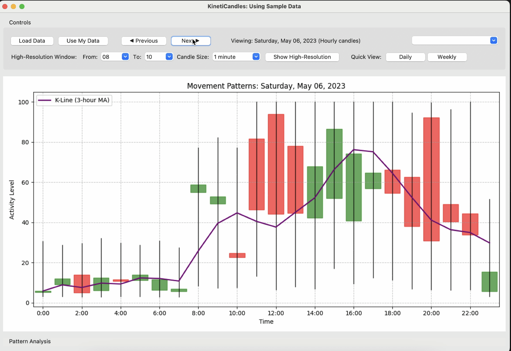
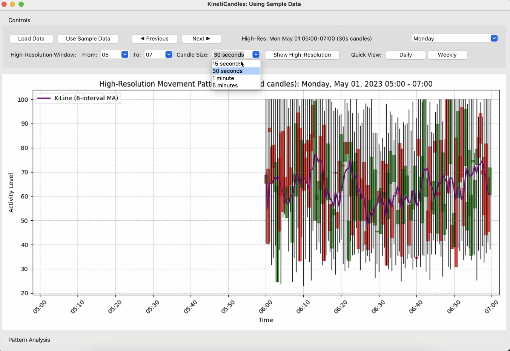
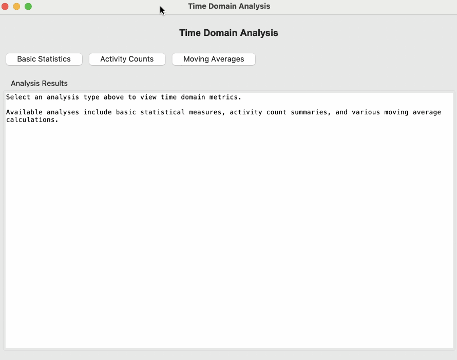
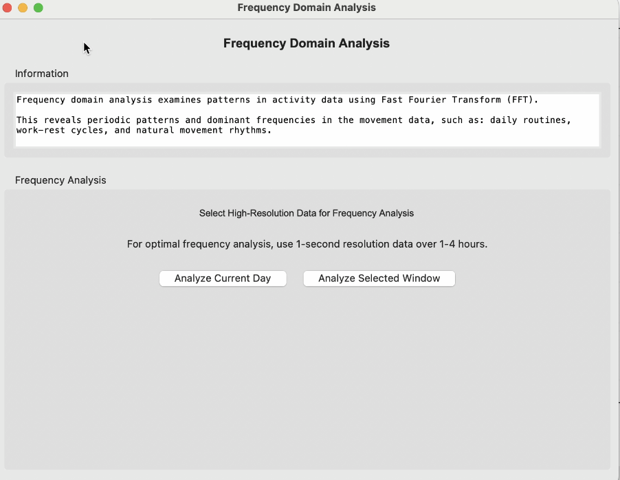
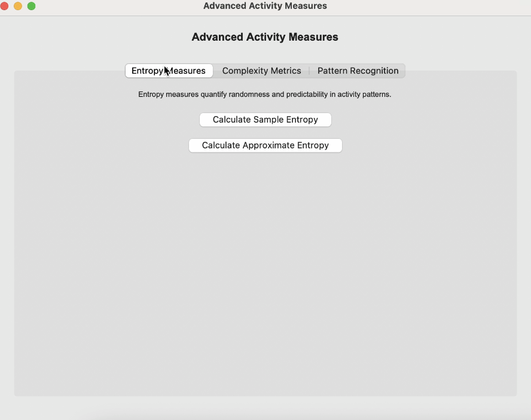
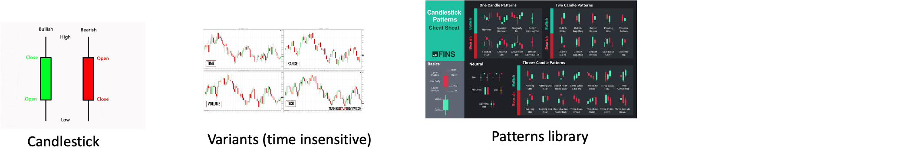

# KinetiCandles

### Decoding Patterns From Financial Visualization to Physical Wellbeing

> Generally it is a visualization tool for analysing temporal movement patterns
>
> The idea was Inspired by K-plots (candlestick charts) used in financial trading.

### Value Proposition

Just as traders use high-resolution K-plots to identify precise entry and exit points, researchers could use movement K-plots to pinpoint optimal intervention times or detect subtle changes that might indicate health changes.

### To do next

* Implement variants to candlesticks (tick charts, range bars, intensity bars) that are insensitive to time offset
* Create a more user-friendly interface for real-time monitoring of accelerometer data
* Build a **Movement Pattern Library** for Reference (like candlestick pattern cheat sheets). The reference guide explains how to interpret temporal patterns, including case studies, example interpretations, and explanations of different temporal movement patterns and their potential implications. In trading, the interpretations for candlestick patterns like "doji," "hammer," and "engulfing" were developed through a combination of historical observation, empirical testing, theoretical market psychology, and refinement through practice. KinetiCandles can use Big Data-Driven Approaches (machine learning techniques, clustering, etc.) and Expert Consultation to identify representative patterns. If establishing patterns specifically identified for human movement becomes too complicated and time-consuming, maybe just adapt existing patterns from trading and provide interpretations related to human movement.
* Incorporate time-domain features, frequency-domain features, and complexity measures derived from data